### Machine learning for aiding the diagnostic of pathology on the Vertebral Column

#### Description
The data have been related to classification tasks.
**column_2C_weka.csv** (file with two class labels)
It consists in classifying patients as belonging to two categories: Normal (100 patients) or Abnormal (210 patients).

#### Attribute Information
Each patient is represented in the data set by six biomechanical attributes derived from the shape and orientation of the pelvis and lumbar spine: pelvic incidence, pelvic tilt, lumbar lordosis angle, sacral slope, pelvic radius and grade of spondylolisthesis. The following convention is used for the class labels: Normal and Abnormal. Files were concerted into CSV.

#### Objective
Use these six biomechanical features to classify orthopadeic patients into two classes (Normal or Abnormal).

#### Summary
The model accuracy were:
With KNN (K=3) accuracy is: 86%
SVM accuracy is: 85%

Random Forest - 89 percent 
GBM - 84 percent 
Logistic Regression - 84 percent 
Decision Trees - 82 percent

#### Acknowledgements
Dua, D. and Karra Taniskidou, E. (2017). UCI Machine Learning Repository [http://archive.ics.uci.edu/ml]. Irvine, CA: University of California, School of Information and Computer Science.

The original dataset was downloaded from UCI ML repository:
Data: Vertebral Column Data Set
http://archive.ics.uci.edu/ml/datasets/vertebral+column#

##### Data Set Information
Biomedical data set built by Dr. Henrique da Mota during a medical residence period in the Group of Applied Research in Orthopaedics (GARO) of the Centre Médico-Chirurgical de Réadaptation des Massues, Lyon, France.


```python
import numpy as np 
```


```python
import warnings
warnings.filterwarnings(action="ignore", module="scipy", message="^internal gelsd")
```


```python
import pandas as pd
```


```python
%matplotlib inline
```


```python
import matplotlib.pyplot as plt
```


```python
import seaborn as sns
```


```python
from subprocess import check_output
```


```python
from sklearn.preprocessing import LabelEncoder
```


```python
data = pd.read_csv('/Users/irene/Downloads/input/column_2C_weka.csv')
```


```python
print(check_output(["ls", "/Users/irene/Downloads/input"]).decode("utf8"))
```

    Biomechanics_v03.ipynb
    column_2C_weka.csv
    column_3C_weka.csv
    


```python
data = pd.read_csv('/Users/irene/Downloads/input/column_2C_weka.csv')
```


```python
data.info()
```

    <class 'pandas.core.frame.DataFrame'>
    RangeIndex: 310 entries, 0 to 309
    Data columns (total 7 columns):
    pelvic_incidence            310 non-null float64
    pelvic_tilt numeric         310 non-null float64
    lumbar_lordosis_angle       310 non-null float64
    sacral_slope                310 non-null float64
    pelvic_radius               310 non-null float64
    degree_spondylolisthesis    310 non-null float64
    class                       310 non-null object
    dtypes: float64(6), object(1)
    memory usage: 17.0+ KB


```python
data.head()
```


<div>
<style>
    .dataframe thead tr:only-child th {
        text-align: right;
    }

    .dataframe thead th {
        text-align: left;
    }

    .dataframe tbody tr th {
        vertical-align: top;
    }
</style>
<table border="1" class="dataframe">
  <thead>
    <tr style="text-align: right;">
      <th></th>
      <th>pelvic_incidence</th>
      <th>pelvic_tilt numeric</th>
      <th>lumbar_lordosis_angle</th>
      <th>sacral_slope</th>
      <th>pelvic_radius</th>
      <th>degree_spondylolisthesis</th>
      <th>class</th>
    </tr>
  </thead>
  <tbody>
    <tr>
      <th>0</th>
      <td>63.027818</td>
      <td>22.552586</td>
      <td>39.609117</td>
      <td>40.475232</td>
      <td>98.672917</td>
      <td>-0.254400</td>
      <td>Abnormal</td>
    </tr>
    <tr>
      <th>1</th>
      <td>39.056951</td>
      <td>10.060991</td>
      <td>25.015378</td>
      <td>28.995960</td>
      <td>114.405425</td>
      <td>4.564259</td>
      <td>Abnormal</td>
    </tr>
    <tr>
      <th>2</th>
      <td>68.832021</td>
      <td>22.218482</td>
      <td>50.092194</td>
      <td>46.613539</td>
      <td>105.985135</td>
      <td>-3.530317</td>
      <td>Abnormal</td>
    </tr>
    <tr>
      <th>3</th>
      <td>69.297008</td>
      <td>24.652878</td>
      <td>44.311238</td>
      <td>44.644130</td>
      <td>101.868495</td>
      <td>11.211523</td>
      <td>Abnormal</td>
    </tr>
    <tr>
      <th>4</th>
      <td>49.712859</td>
      <td>9.652075</td>
      <td>28.317406</td>
      <td>40.060784</td>
      <td>108.168725</td>
      <td>7.918501</td>
      <td>Abnormal</td>
    </tr>
  </tbody>
</table>
</div>


```python
data.describe()
```


<div>
<style>
    .dataframe thead tr:only-child th {
        text-align: right;
    }

    .dataframe thead th {
        text-align: left;
    }

    .dataframe tbody tr th {
        vertical-align: top;
    }
</style>
<table border="1" class="dataframe">
  <thead>
    <tr style="text-align: right;">
      <th></th>
      <th>pelvic_incidence</th>
      <th>pelvic_tilt numeric</th>
      <th>lumbar_lordosis_angle</th>
      <th>sacral_slope</th>
      <th>pelvic_radius</th>
      <th>degree_spondylolisthesis</th>
    </tr>
  </thead>
  <tbody>
    <tr>
      <th>count</th>
      <td>310.000000</td>
      <td>310.000000</td>
      <td>310.000000</td>
      <td>310.000000</td>
      <td>310.000000</td>
      <td>310.000000</td>
    </tr>
    <tr>
      <th>mean</th>
      <td>60.496653</td>
      <td>17.542822</td>
      <td>51.930930</td>
      <td>42.953831</td>
      <td>117.920655</td>
      <td>26.296694</td>
    </tr>
    <tr>
      <th>std</th>
      <td>17.236520</td>
      <td>10.008330</td>
      <td>18.554064</td>
      <td>13.423102</td>
      <td>13.317377</td>
      <td>37.559027</td>
    </tr>
    <tr>
      <th>min</th>
      <td>26.147921</td>
      <td>-6.554948</td>
      <td>14.000000</td>
      <td>13.366931</td>
      <td>70.082575</td>
      <td>-11.058179</td>
    </tr>
    <tr>
      <th>25%</th>
      <td>46.430294</td>
      <td>10.667069</td>
      <td>37.000000</td>
      <td>33.347122</td>
      <td>110.709196</td>
      <td>1.603727</td>
    </tr>
    <tr>
      <th>50%</th>
      <td>58.691038</td>
      <td>16.357689</td>
      <td>49.562398</td>
      <td>42.404912</td>
      <td>118.268178</td>
      <td>11.767934</td>
    </tr>
    <tr>
      <th>75%</th>
      <td>72.877696</td>
      <td>22.120395</td>
      <td>63.000000</td>
      <td>52.695888</td>
      <td>125.467674</td>
      <td>41.287352</td>
    </tr>
    <tr>
      <th>max</th>
      <td>129.834041</td>
      <td>49.431864</td>
      <td>125.742385</td>
      <td>121.429566</td>
      <td>163.071041</td>
      <td>418.543082</td>
    </tr>
  </tbody>
</table>
</div>


### Scatter plot


```python
color_list = ['orange' if i=='Abnormal' else 'green' for i in data.loc[:,'class']]
pd.plotting.scatter_matrix(data.loc[:, data.columns != 'class'],
                                       c=color_list,
                                       figsize= [15,15],
                                       diagonal='hist',
                                       alpha=0.5,
                                       s = 200,
                                       marker = '+',
                                       edgecolor= "black")
plt.show()
```


### Counts number of classes

### Corrrelation map


```python
sns.countplot(x="class", data=data)
data.loc[:,'class'].value_counts()
```


    Abnormal    210
    Normal      100
    Name: class, dtype: int64


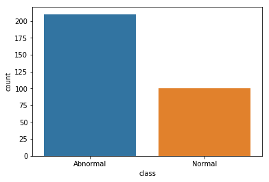


We found that more abnormal (210 cases )than normal (100 cases) in the dataset.


```python
x = data.drop("class", axis=1)
```


```python
y = data["class"]
```


```python
le = LabelEncoder()
le.fit(y)
y=le.transform(y)
data1=x
data1['class']=y
```


```python
colormap = plt.cm.plasma
plt.figure(figsize=(7,7))
plt.title('Pearson Correlation of Features', y=1.05, size=15)
sns.heatmap(data1.astype(float).corr(),linewidths=0.1,vmax=1.0, square=True, cmap=colormap, 
            linecolor='black', annot=True)
```


    <matplotlib.axes._subplots.AxesSubplot at 0x11647ecc0>


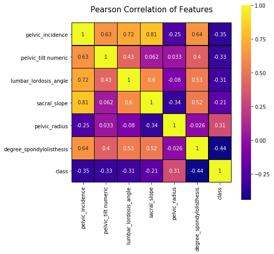


The highest correlation of Pelvic Incidence are sacral_slope (0.81), followed by lumbar_lordosis_angle (0.72), degree_spondylolisthesis (0.64) and pelvic_tilt_numermic (0.63)

### Boxplot


```python
sns.set_style("whitegrid")
plt.figure(figsize=(14,14))
sns.boxplot(data=data, orient="h")
```


    <matplotlib.axes._subplots.AxesSubplot at 0x116d27ba8>


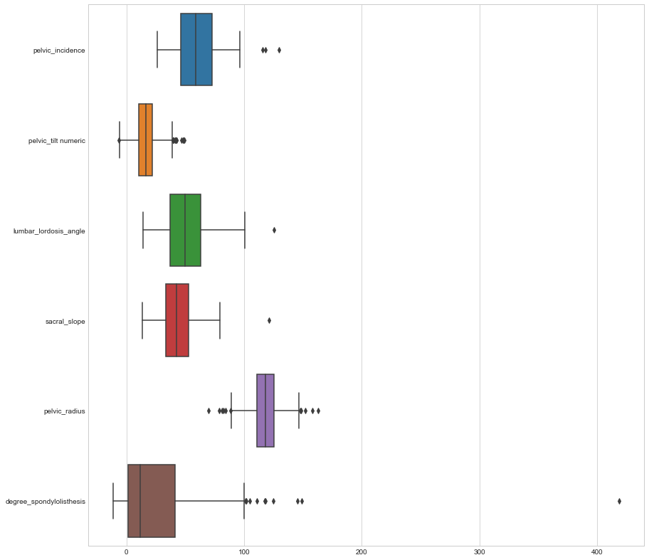


```python
sns.set(style="ticks")
sns.pairplot(data, hue="class", size = 4)
```


    <seaborn.axisgrid.PairGrid at 0x116ccd780>


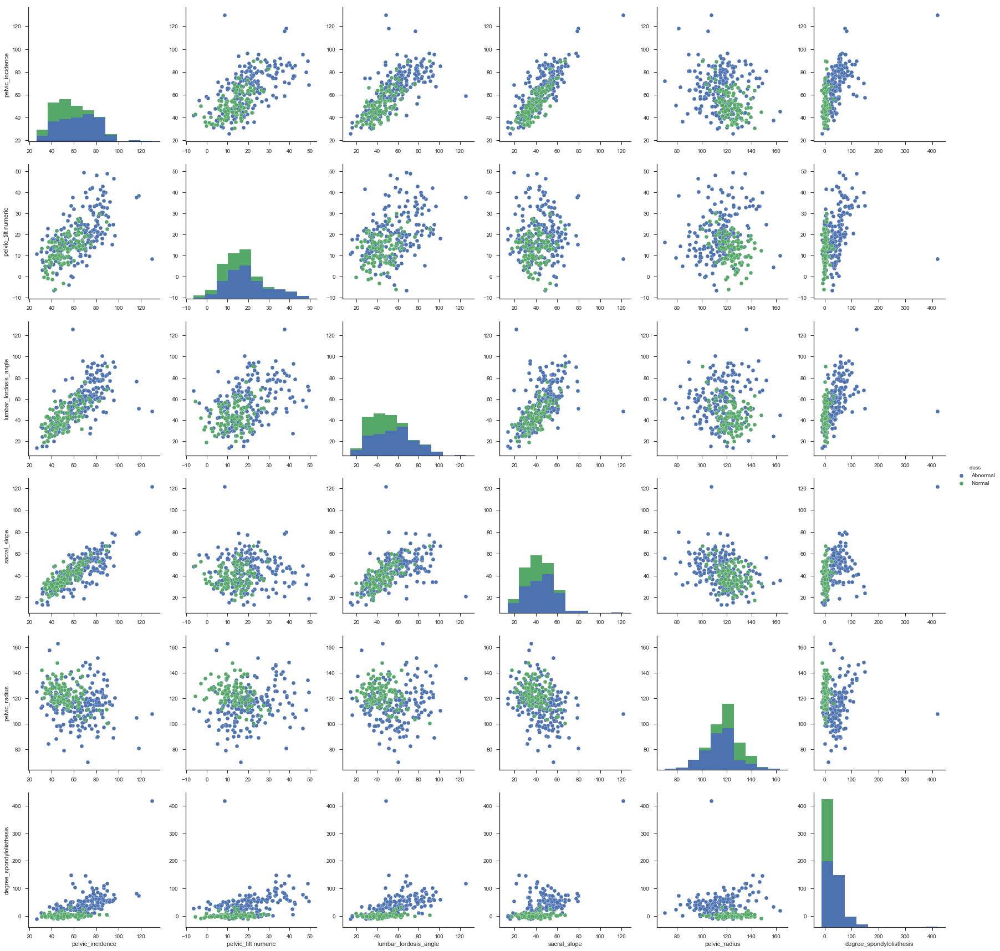


## Classification

### K-Nearnest Neighbors(KNN)

#### Compared with Logistic Regression, CART, Random Forest, KNN is easier for interpretation and low calculation time.


```python
# KNN
from sklearn.neighbors import KNeighborsClassifier
knn = KNeighborsClassifier(n_neighbors = 3)
x,y = data.loc[:,data.columns != 'class'], data.loc[:,'class']
knn.fit(x,y)
prediction = knn.predict(x)
print('Prediction: {}'.format(prediction))
```

    Prediction: ['Abnormal' 'Abnormal' 'Abnormal' 'Abnormal' 'Abnormal' 'Normal' 'Normal'
     'Abnormal' 'Normal' 'Abnormal' 'Abnormal' 'Abnormal' 'Abnormal'
     'Abnormal' 'Abnormal' 'Abnormal' 'Abnormal' 'Abnormal' 'Abnormal'
     'Abnormal' 'Normal' 'Normal' 'Normal' 'Abnormal' 'Abnormal' 'Abnormal'
     'Abnormal' 'Abnormal' 'Abnormal' 'Abnormal' 'Normal' 'Abnormal' 'Normal'
     'Normal' 'Abnormal' 'Abnormal' 'Abnormal' 'Abnormal' 'Abnormal'
     'Abnormal' 'Abnormal' 'Abnormal' 'Abnormal' 'Abnormal' 'Abnormal'
     'Abnormal' 'Abnormal' 'Abnormal' 'Abnormal' 'Abnormal' 'Abnormal'
     'Abnormal' 'Abnormal' 'Abnormal' 'Abnormal' 'Abnormal' 'Abnormal'
     'Abnormal' 'Abnormal' 'Abnormal' 'Abnormal' 'Abnormal' 'Abnormal'
     'Abnormal' 'Abnormal' 'Abnormal' 'Abnormal' 'Abnormal' 'Normal'
     'Abnormal' 'Abnormal' 'Abnormal' 'Abnormal' 'Abnormal' 'Abnormal'
     'Abnormal' 'Abnormal' 'Abnormal' 'Abnormal' 'Abnormal' 'Abnormal'
     'Abnormal' 'Abnormal' 'Abnormal' 'Abnormal' 'Abnormal' 'Abnormal'
     'Abnormal' 'Abnormal' 'Abnormal' 'Abnormal' 'Abnormal' 'Abnormal'
     'Abnormal' 'Abnormal' 'Abnormal' 'Abnormal' 'Abnormal' 'Abnormal'
     'Abnormal' 'Abnormal' 'Abnormal' 'Abnormal' 'Abnormal' 'Abnormal'
     'Abnormal' 'Abnormal' 'Abnormal' 'Abnormal' 'Abnormal' 'Abnormal'
     'Abnormal' 'Abnormal' 'Abnormal' 'Abnormal' 'Abnormal' 'Abnormal'
     'Abnormal' 'Abnormal' 'Abnormal' 'Abnormal' 'Abnormal' 'Abnormal'
     'Abnormal' 'Abnormal' 'Abnormal' 'Abnormal' 'Abnormal' 'Abnormal'
     'Abnormal' 'Abnormal' 'Normal' 'Abnormal' 'Abnormal' 'Abnormal'
     'Abnormal' 'Abnormal' 'Abnormal' 'Abnormal' 'Abnormal' 'Abnormal'
     'Abnormal' 'Abnormal' 'Abnormal' 'Abnormal' 'Abnormal' 'Abnormal'
     'Abnormal' 'Abnormal' 'Abnormal' 'Abnormal' 'Abnormal' 'Abnormal'
     'Abnormal' 'Abnormal' 'Abnormal' 'Abnormal' 'Abnormal' 'Abnormal'
     'Abnormal' 'Abnormal' 'Abnormal' 'Abnormal' 'Abnormal' 'Abnormal'
     'Abnormal' 'Abnormal' 'Abnormal' 'Abnormal' 'Abnormal' 'Abnormal'
     'Normal' 'Abnormal' 'Abnormal' 'Abnormal' 'Abnormal' 'Abnormal'
     'Abnormal' 'Abnormal' 'Abnormal' 'Abnormal' 'Abnormal' 'Abnormal'
     'Abnormal' 'Abnormal' 'Abnormal' 'Abnormal' 'Abnormal' 'Abnormal'
     'Abnormal' 'Abnormal' 'Abnormal' 'Abnormal' 'Abnormal' 'Abnormal'
     'Abnormal' 'Abnormal' 'Abnormal' 'Abnormal' 'Abnormal' 'Abnormal'
     'Abnormal' 'Abnormal' 'Abnormal' 'Abnormal' 'Abnormal' 'Abnormal'
     'Abnormal' 'Abnormal' 'Abnormal' 'Abnormal' 'Normal' 'Normal' 'Normal'
     'Normal' 'Normal' 'Normal' 'Normal' 'Normal' 'Normal' 'Normal' 'Normal'
     'Abnormal' 'Normal' 'Normal' 'Normal' 'Normal' 'Normal' 'Normal' 'Normal'
     'Normal' 'Normal' 'Normal' 'Normal' 'Abnormal' 'Normal' 'Normal' 'Normal'
     'Normal' 'Normal' 'Normal' 'Abnormal' 'Normal' 'Normal' 'Abnormal'
     'Normal' 'Normal' 'Normal' 'Normal' 'Abnormal' 'Normal' 'Normal' 'Normal'
     'Normal' 'Normal' 'Abnormal' 'Normal' 'Normal' 'Normal' 'Normal' 'Normal'
     'Normal' 'Normal' 'Normal' 'Normal' 'Normal' 'Normal' 'Normal' 'Normal'
     'Normal' 'Normal' 'Normal' 'Normal' 'Normal' 'Normal' 'Normal' 'Normal'
     'Normal' 'Normal' 'Normal' 'Normal' 'Normal' 'Normal' 'Normal' 'Normal'
     'Normal' 'Normal' 'Normal' 'Normal' 'Normal' 'Normal' 'Normal' 'Normal'
     'Abnormal' 'Normal' 'Normal' 'Normal' 'Abnormal' 'Normal' 'Normal'
     'Normal' 'Normal' 'Normal' 'Normal' 'Normal' 'Abnormal' 'Normal'
     'Abnormal' 'Normal' 'Normal']


Then split data into train (70%) and test sets (30%). 
where 
x: features; 
y: target variables (normal/abnormal); 


```python
# Train & test, for K=3
from sklearn.model_selection import train_test_split
x_train,x_test,y_train,y_test = train_test_split(x,y,test_size = 0.3,random_state = 1)
knn = KNeighborsClassifier(n_neighbors = 3)
x,y = data.loc[:,data.columns != 'class'], data.loc[:,'class']
# Fit on train sets
knn.fit(x_train,y_train)
prediction = knn.predict(x_test)
#print('Prediction: {}'.format(prediction))
#predict and give accuracy on test sets
print('With KNN (K=3) accuracy is: ',knn.score(x_test,y_test)) # accuracy
```

    With KNN (K=3) accuracy is:  0.8602150537634409


#### Test the model complexity


```python
# Test Model complexity
neig = np.arange(1, 25)
train_accuracy = []
test_accuracy = []
# Check different values of k  
for i, k in enumerate(neig):
    # k from 1 to 25(exclude)
    knn = KNeighborsClassifier(n_neighbors=k)
    # Fit with knn
    knn.fit(x_train,y_train)
    #train accuracy
    train_accuracy.append(knn.score(x_train, y_train))
    # test accuracy
    test_accuracy.append(knn.score(x_test, y_test))

# Plot
plt.figure(figsize=[13,8])
plt.plot(neig, test_accuracy, label = 'Testing Accuracy')
plt.plot(neig, train_accuracy, label = 'Training Accuracy')
plt.legend()
plt.title('k value VS Accuracy')
plt.xlabel('Number of Neighbors')
plt.ylabel('Accuracy')
plt.xticks(neig)
plt.show()
print("Best accuracy is {} with K = {}".format(np.max(test_accuracy),1+test_accuracy.index(np.max(test_accuracy))))
```


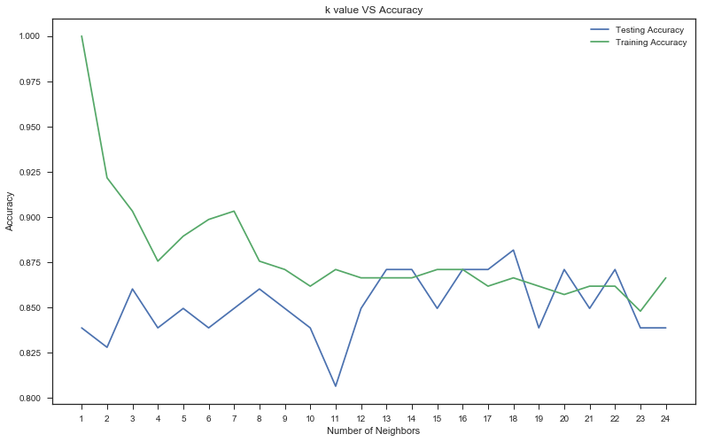


    Best accuracy is 0.8817204301075269 with K = 18


Regression


```python
# From Abnormal group, pelvic_incidence as a feature and sacral_slope as a target variable
data1 = data[data['class'] =='Abnormal']
x = np.array(data1.loc[:,'pelvic_incidence']).reshape(-1,1)
y = np.array(data1.loc[:,'sacral_slope']).reshape(-1,1)
# Scatter
plt.figure(figsize=[10,10])
plt.scatter(x=x,y=y)
plt.xlabel('pelvic_incidence')
plt.ylabel('sacral_slope')
plt.show()
```


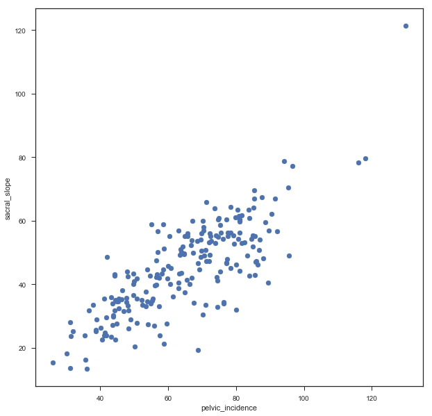


### Linear Regression


```python
# LinearRegression
from sklearn.linear_model import LinearRegression
reg = LinearRegression()
# Predict space
predict_space = np.linspace(min(x), max(x)).reshape(-1,1)
# Fit
reg.fit(x,y)
# Predict
predicted = reg.predict(predict_space)
# R^2 
print('R^2 score: ',reg.score(x, y))
# Plot regression line and scatter
plt.plot(predict_space, predicted, color='black', linewidth=3)
plt.scatter(x=x,y=y)
plt.xlabel('pelvic_incidence')
plt.ylabel('sacral_slope')
plt.show()
```

    R^2 score:  0.6458410481075871


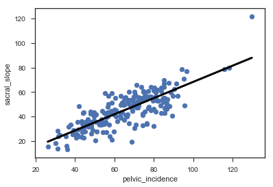


### Cross Validation


```python
from sklearn.model_selection import cross_val_score
reg = LinearRegression()
k = 5
cv_result = cross_val_score(reg,x,y,cv=k) # uses R^2 as score 
print('CV Scores: ',cv_result)
print('CV scores average: ',np.sum(cv_result)/k)
```

    CV Scores:  [0.32924233 0.61683991 0.53117056 0.1954798  0.29299864]
    CV scores average:  0.39314625028848665


Ridge regression

Ridge regression lost fuction = OLS + alpha * sum(parameter^2)


```python
# Ridge
from sklearn.linear_model import Ridge
x_train,x_test,y_train,y_test = train_test_split(x,y,random_state = 2, test_size = 0.3)
ridge = Ridge(alpha = 0.1, normalize = True)
ridge.fit(x_train,y_train)
ridge_predict = ridge.predict(x_test)
print('Ridge score: ',ridge.score(x_test,y_test))
```

    Ridge score:  0.5608287918841997


```python
# New Lasso
from sklearn.linear_model import Lasso
x = np.array(data1.loc[:,['pelvic_incidence','pelvic_tilt numeric','lumbar_lordosis_angle','pelvic_radius']])
x_train,x_test,y_train,y_test = train_test_split(x,y,random_state = 3, test_size = 0.3)
lasso = Lasso(alpha = 0.1, normalize = True)
lasso.fit(x_train,y_train)
ridge_predict = lasso.predict(x_test)
print('Lasso score: ',lasso.score(x_test,y_test))
print('Lasso coefficients: ',lasso.coef_)
```

    Lasso score:  0.9640334804327547
    Lasso coefficients:  [ 0.82498243 -0.7209057   0.         -0.        ]


We found that pelvic_incidence and pelvic_tilt numeric are significant features.


```python
# Confusion matrix with random forest
from sklearn.metrics import classification_report, confusion_matrix
from sklearn.ensemble import RandomForestClassifier
x,y = data.loc[:,data.columns != 'class'], data.loc[:,'class']
x_train,x_test,y_train,y_test = train_test_split(x,y,test_size = 0.3,random_state = 1)
rf = RandomForestClassifier(random_state = 4)
rf.fit(x_train,y_train)
y_pred = rf.predict(x_test)
cm = confusion_matrix(y_test,y_pred)
print('Confusion matrix: \n',cm)
print('Classification report: \n',classification_report(y_test,y_pred))
```

    Confusion matrix: 
     [[58  8]
     [ 7 20]]
    Classification report: 
                  precision    recall  f1-score   support
    
       Abnormal       0.89      0.88      0.89        66
         Normal       0.71      0.74      0.73        27
    
    avg / total       0.84      0.84      0.84        93
    


```python
# visualize with seaborn library
sns.heatmap(cm,annot=True,fmt="d") 
plt.show()
```


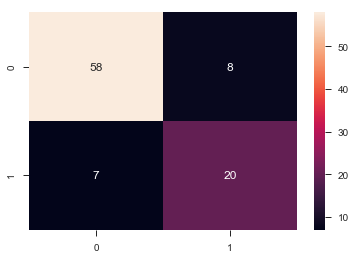


```python
# ROC Curve with logistic regression
from sklearn.metrics import roc_curve
from sklearn.linear_model import LogisticRegression
from sklearn.metrics import confusion_matrix, classification_report
# abnormal = 1 and normal = 0
data['class_binary'] = [1 if i == 'Abnormal' else 0 for i in data.loc[:,'class']]
x,y = data.loc[:,(data.columns != 'class') & (data.columns != 'class_binary')], data.loc[:,'class_binary']
x_train, x_test, y_train, y_test = train_test_split(x, y, test_size = 0.3, random_state=42)
logreg = LogisticRegression()
logreg.fit(x_train,y_train)
y_pred_prob = logreg.predict_proba(x_test)[:,1]
fpr, tpr, thresholds = roc_curve(y_test, y_pred_prob)
# Plot ROC curve
plt.plot([0, 1], [0, 1], 'k--')
plt.plot(fpr, tpr)
plt.xlabel('False Positive Rate')
plt.ylabel('True Positive Rate')
plt.title('ROC')
plt.show()
```


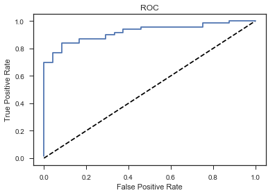


#### Pre-Processing Data


```python
# Load data
data = pd.read_csv('/Users/irene/Downloads/input/column_2C_weka.csv')
# get_dummies
df = pd.get_dummies(data,drop_first = True)
df.head(10)
```


<div>
<style>
    .dataframe thead tr:only-child th {
        text-align: right;
    }

    .dataframe thead th {
        text-align: left;
    }

    .dataframe tbody tr th {
        vertical-align: top;
    }
</style>
<table border="1" class="dataframe">
  <thead>
    <tr style="text-align: right;">
      <th></th>
      <th>pelvic_incidence</th>
      <th>pelvic_tilt numeric</th>
      <th>lumbar_lordosis_angle</th>
      <th>sacral_slope</th>
      <th>pelvic_radius</th>
      <th>degree_spondylolisthesis</th>
      <th>class_Normal</th>
    </tr>
  </thead>
  <tbody>
    <tr>
      <th>0</th>
      <td>63.027818</td>
      <td>22.552586</td>
      <td>39.609117</td>
      <td>40.475232</td>
      <td>98.672917</td>
      <td>-0.254400</td>
      <td>0</td>
    </tr>
    <tr>
      <th>1</th>
      <td>39.056951</td>
      <td>10.060991</td>
      <td>25.015378</td>
      <td>28.995960</td>
      <td>114.405425</td>
      <td>4.564259</td>
      <td>0</td>
    </tr>
    <tr>
      <th>2</th>
      <td>68.832021</td>
      <td>22.218482</td>
      <td>50.092194</td>
      <td>46.613539</td>
      <td>105.985135</td>
      <td>-3.530317</td>
      <td>0</td>
    </tr>
    <tr>
      <th>3</th>
      <td>69.297008</td>
      <td>24.652878</td>
      <td>44.311238</td>
      <td>44.644130</td>
      <td>101.868495</td>
      <td>11.211523</td>
      <td>0</td>
    </tr>
    <tr>
      <th>4</th>
      <td>49.712859</td>
      <td>9.652075</td>
      <td>28.317406</td>
      <td>40.060784</td>
      <td>108.168725</td>
      <td>7.918501</td>
      <td>0</td>
    </tr>
    <tr>
      <th>5</th>
      <td>40.250200</td>
      <td>13.921907</td>
      <td>25.124950</td>
      <td>26.328293</td>
      <td>130.327871</td>
      <td>2.230652</td>
      <td>0</td>
    </tr>
    <tr>
      <th>6</th>
      <td>53.432928</td>
      <td>15.864336</td>
      <td>37.165934</td>
      <td>37.568592</td>
      <td>120.567523</td>
      <td>5.988551</td>
      <td>0</td>
    </tr>
    <tr>
      <th>7</th>
      <td>45.366754</td>
      <td>10.755611</td>
      <td>29.038349</td>
      <td>34.611142</td>
      <td>117.270068</td>
      <td>-10.675871</td>
      <td>0</td>
    </tr>
    <tr>
      <th>8</th>
      <td>43.790190</td>
      <td>13.533753</td>
      <td>42.690814</td>
      <td>30.256437</td>
      <td>125.002893</td>
      <td>13.289018</td>
      <td>0</td>
    </tr>
    <tr>
      <th>9</th>
      <td>36.686353</td>
      <td>5.010884</td>
      <td>41.948751</td>
      <td>31.675469</td>
      <td>84.241415</td>
      <td>0.664437</td>
      <td>0</td>
    </tr>
  </tbody>
</table>
</div>


```python
# SVM, pre-process and pipeline
from sklearn.svm import SVC
from sklearn.preprocessing import StandardScaler
from sklearn.pipeline import Pipeline
from sklearn.model_selection import GridSearchCV
from sklearn.model_selection import train_test_split

steps = [('scalar', StandardScaler()),
         ('SVM', SVC())]
pipeline = Pipeline(steps)
parameters = {'SVM__C':[1, 10, 100],
              'SVM__gamma':[0.1, 0.01]}
x_train, x_test, y_train, y_test = train_test_split(x,y,test_size=0.2,random_state = 1)
cv = GridSearchCV(pipeline,param_grid=parameters,cv=3)
cv.fit(x_train,y_train)

y_pred = cv.predict(x_test)

print("Accuracy: {}".format(cv.score(x_test, y_test)))
print("Tuned Model Parameters: {}".format(cv.best_params_))
```

    Accuracy: 0.8548387096774194
    Tuned Model Parameters: {'SVM__C': 100, 'SVM__gamma': 0.01}


### Unsupervised learning

####  Scatter plot


```python
# As you can see there is no labels in data
# "pelvic_radius" vs "degree_spondylolisthesis"
data = pd.read_csv('/Users/irene/Downloads/input/column_2C_weka.csv')
plt.scatter(data['pelvic_radius'],data['degree_spondylolisthesis'])
plt.xlabel('pelvic_radius')
plt.ylabel('degree_spondylolisthesis')
plt.show()
```


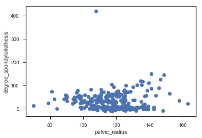


####  KMeans Clustering


```python
data2 = data.loc[:,['degree_spondylolisthesis','pelvic_radius']]
from sklearn.cluster import KMeans
kmeans = KMeans(n_clusters = 2)
kmeans.fit(data2)
labels = kmeans.predict(data2)
plt.scatter(data['pelvic_radius'],data['degree_spondylolisthesis'],c = labels)
plt.xlabel('pelvic_radius')
plt.ylabel('degree_spondylolisthesis')
plt.show()
```


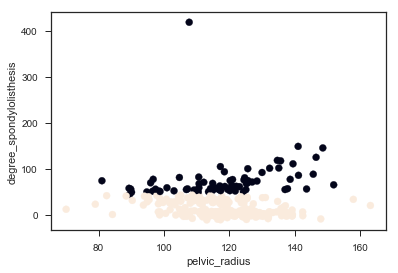


#### Evaluation of Clustering


```python
# cross tabulation table
df = pd.DataFrame({'labels':labels,"class":data['class']})
ct = pd.crosstab(df['labels'],df['class'])
print(ct)
```

    class   Abnormal  Normal
    labels                  
    0            138     100
    1             72       0


From above result, we found two clusters which are 0 and 1
class 0 have 138 abnormal and 100 normal patients.
Class 1 have 72 abnormal and 0 normal patiens.

### Validation by inertia


```python
# inertia
inertia_list = np.empty(8)
for i in range(1,8):
    kmeans = KMeans(n_clusters=i)
    kmeans.fit(data2)
    inertia_list[i] = kmeans.inertia_
plt.plot(range(0,8),inertia_list,'-o')
plt.xlabel('Number of cluster')
plt.ylabel('Inertia')
plt.show()
```


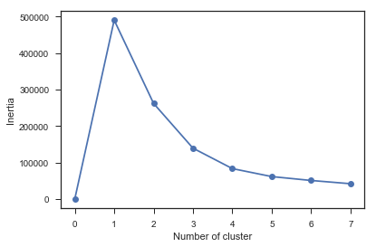


From the above graph, the optimal no. of cluster is 2. 

#### Standardization


```python
data = pd.read_csv('/Users/irene/Downloads/input/column_2C_weka.csv')
data3 = data.drop('class',axis = 1)
```


```python
from sklearn.preprocessing import StandardScaler
from sklearn.pipeline import make_pipeline
scalar = StandardScaler()
kmeans = KMeans(n_clusters = 2)
pipe = make_pipeline(scalar,kmeans)
pipe.fit(data3)
labels = pipe.predict(data3)
df = pd.DataFrame({'labels':labels,"class":data['class']})
ct = pd.crosstab(df['labels'],df['class'])
print(ct)
```

    class   Abnormal  Normal
    labels                  
    0             94      90
    1            116      10


#### Hierarchy


```python
from scipy.cluster.hierarchy import linkage,dendrogram
merg = linkage(data3.iloc[200:220,:],method = 'single')
dendrogram(merg, leaf_rotation = 90, leaf_font_size = 6)
plt.show()
```


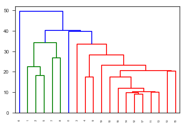


#### T - Distributed Stochastic Neighbor Embedding (T - SNE)


```python
from sklearn.manifold import TSNE
model = TSNE(learning_rate=100)
transformed = model.fit_transform(data2)
x = transformed[:,0]
y = transformed[:,1]
plt.scatter(x,y,c = color_list )
plt.xlabel('pelvic_radius')
plt.ylabel('degree_spondylolisthesis')
plt.show()
```


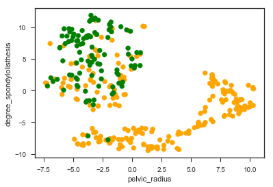


Principle Component Analysis (PCA)


```python
from sklearn.decomposition import PCA
model = PCA()
model.fit(data3)
transformed = model.transform(data3)
print('Principle components: ',model.components_)
```

    Principle components:  [[ 3.23645647e-01  1.13192291e-01  3.03674740e-01  2.10453357e-01
      -2.99598300e-02  8.63153779e-01]
     [-4.76634849e-01 -9.85632787e-02 -5.32783979e-01 -3.78071570e-01
       3.21809199e-01  4.82438036e-01]
     [-1.54481282e-03 -2.64657410e-01 -4.96541893e-01  2.63112598e-01
      -7.74612852e-01  1.18940778e-01]
     [ 3.73677251e-01  7.54113757e-01 -3.39411757e-01 -3.80436506e-01
      -1.75106042e-01 -3.29143086e-02]
     [-4.41703869e-01  7.35414748e-02  5.12024113e-01 -5.15245344e-01
      -5.14639730e-01  8.35992525e-02]
     [ 5.77350269e-01 -5.77350269e-01 -1.08929793e-11 -5.77350269e-01
      -3.59070608e-12  3.06733448e-12]]


```python
# PCA variance
scaler = StandardScaler()
pca = PCA()
pipeline = make_pipeline(scaler,pca)
pipeline.fit(data3)

plt.bar(range(pca.n_components_), pca.explained_variance_)
plt.xlabel('PCA feature')
plt.ylabel('variance')
plt.show()
```


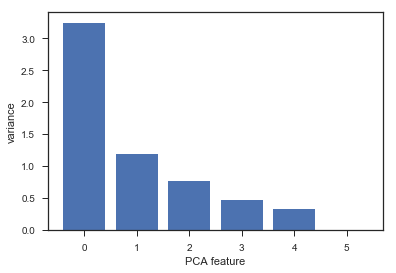


```python
# apply PCA with 2 components
pca = PCA(n_components = 2)
pca.fit(data3)
transformed = pca.transform(data3)
x = transformed[:,0]
y = transformed[:,1]
plt.scatter(x,y,c = color_list)
plt.show()
```


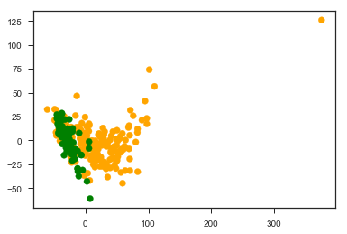

